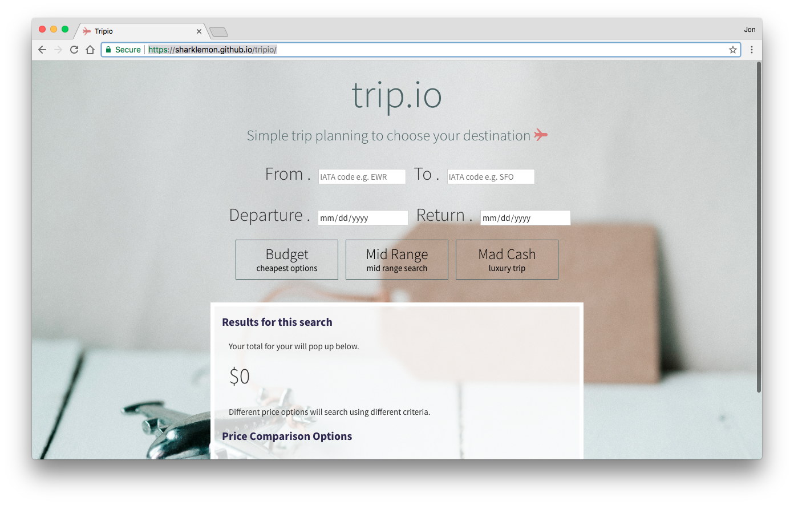
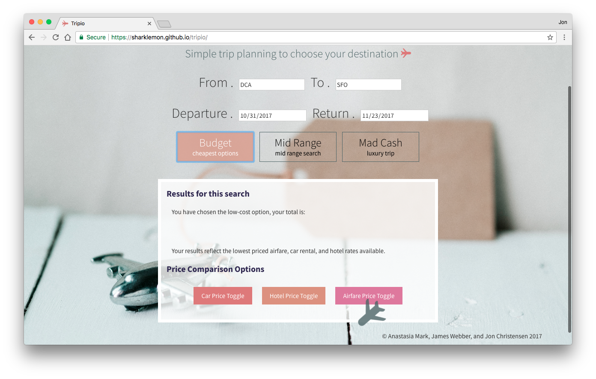
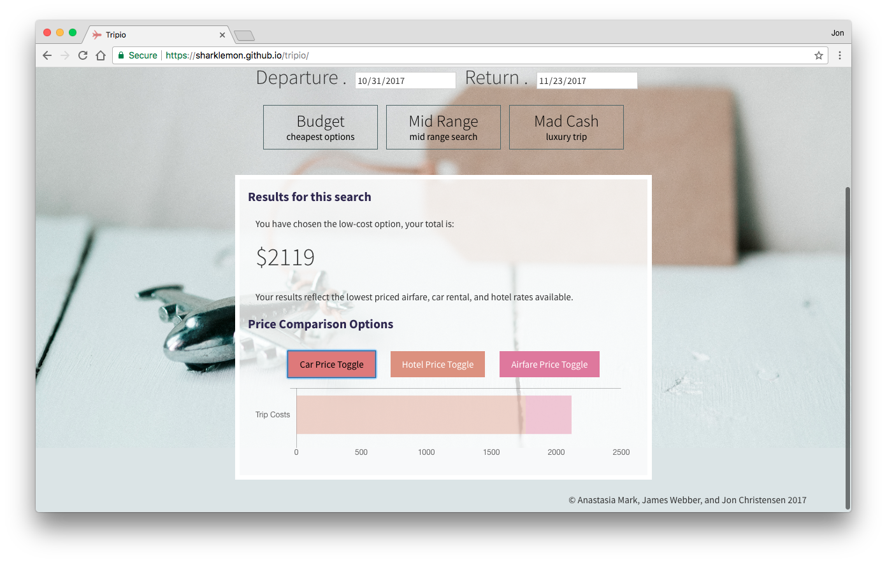

# tripio
Tripio is an online web app that estimates the airline, car rental, and hotel costs of a trip. A live version can be viewed at https://sharklemon.github.io/tripio/

## Description

Ever wonder how expensive it may be to travel to a destination? Tripio takes most of the busy work out of your hands by estimating the airfare, car rental, and hotel costs. Just enter your destination and home airports, along with start and end dates, and Tripio will do the rest.

Tripio also offers three different pricing tiers: Budget, Mid-Range, and Mad Cash. Each pricing tier will find the least expensive option in its class, including tax.

	Budget - cheapest airfare, car rental, and hotel listing
	Mid-Range - non-stop airfare, full or standard size car rental, and 3 star or higher hotel listing
	Mad Cash - non-stop business or first class airfare, luxury car rental, and 4 star or higher hotel listing

Once you have entered your airports and travel dates, select the pricing tier you like and Tripio will compile the price estimates. The overall price will be displayed upon completion, with a rough breakdown of costs between airfare, car rental, and hotel stay shown in a column graph below that. If for some reason you do not need one of the services, you can remove it from the price estimate and graph with the toggle buttons.

### Development

This app was developed by Anastasia Marks, James Webber, and Jon Christensen as the first group project of the GW Coding Bootcamp. It was built using HTML5, CSS3 with Bootstrap, Javascript, and jQuery. It also featured Chart.js. For more information on Chart.js see http://www.chartjs.org/.

Price estimates were conducted using AJAX calls to two different APIs. Flight pricing was gathered via a POST request to the Google Flights API (QPX Express), while Car rental and hotel pricing used a GET request to the Hotwire API. Information for both of these APIs can be found at https://developers.google.com/qpx-express/ and http://developer.hotwire.com/.

Due to limitations in the API requests, trips may not be more than 30 days in length.

## Screenshots
### Tripio

### Searching for a trip

### Price Estimate & Breakdown, car rental excluded
